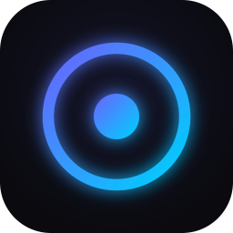

<p align="center">
  
</p>

<p align="center">
  <strong>Open VPN engine</strong> used inside <em>TheTochka VPN: VPN Marketplace</em><br>
  based on <a href="https://github.com/SagerNet/sing-box-for-apple">sing-box for Apple</a> · Libbox · GNU GPLv3
</p>

<p align="center">
  <a href="https://thetochka.com/sing-box-for-apple/"></a>
  <a href="https://thetochka.com/"></a>
  <a href="LICENSE"></a>
  <a href="https://github.com/SagerNet/sing-box-for-apple"></a>
</p>

---

## What this repository is

This is a **public fork of [sing-box for Apple](https://github.com/SagerNet/sing-box-for-apple)** (SFI / SFM / SFT), plus TheTochka’s engine overlay used in the App Store binary.

It is the **Corresponding Source** for the open VPN client / network engine shipped inside the TheTochka iOS app. The engine is **Libbox**, built from [sing-box](https://github.com/SagerNet/sing-box).

| App Store | Git |
| --- | --- |
| TheTochka `2.0.0` (build `95`) | tag [`v2.0.0+build.95`](https://github.com/TheTochka/thetochka-vpn-client/releases/tag/v2.0.0%2Bbuild.95) |

See [DIFFERENCES.md](DIFFERENCES.md) and [THIRD-PARTY-NOTICES.md](THIRD-PARTY-NOTICES.md). Exact tunnel sources: [`TheTochkaEngine/`](TheTochkaEngine/).

| Open in this repo | Not in this repo |
| --- | --- |
| Apple client sources (upstream) + TheTochka engine overlay | TheTochka VPN: VPN Marketplace (catalog, accounts, payments, backend) |
| Packet Tunnel / Libbox client library used in the store binary | Proprietary Flutter UI of the marketplace |
| GPLv3 license and copyright notices | Trademarks, logos, and product branding of TheTochka |

TheTochka is **not affiliated with, endorsed by, or an official product of SagerNet**. This project is independently based on sing-box for Apple.

**Product:** [thetochka.com](https://thetochka.com/)  
**Engine page:** [thetochka.com/sing-box-for-apple](https://thetochka.com/sing-box-for-apple/)

---

## License (GNU GPLv3)

Copyright (C) 2022 by nekohasekai &lt;contact-sagernet@sekai.icu&gt;

This program is free software: you can redistribute it and/or modify it under the terms of the GNU General Public License as published by the Free Software Foundation, either version 3 of the License, or (at your option) any later version.

This program is distributed **without any warranty**. See [LICENSE](LICENSE) and <https://www.gnu.org/licenses/>.

### Source independently of the App Store

A binary of this engine is distributed as part of TheTochka on the App Store. The GNU GPL applies to **this source code**. You may obtain, study, modify, and build it from this repository **without using the App Store**. Nobody is required to use the App Store copy.

TheTochka product terms, if any, **do not restrict** the rights granted by GPLv3 for this client/engine (modification, private use, and redistribution of the GPL-covered work).

---

## Build (Corresponding Source)

These are the upstream steps to generate, install, and run the Apple client with your own Apple ID.

1. Build **Libbox** from [sing-box](https://github.com/SagerNet/sing-box) sources matching this client:

   ```bash
   go run ./cmd/internal/build_libbox -target apple
   ```

2. Place `Libbox.xcframework` in the project root.
3. Open `sing-box.xcodeproj`.
4. Select scheme **SFI** (iOS), **SFM** / **SFM.System** (macOS), or **SFT** (tvOS).
5. Sign with your team and install on a device.

Upstream documentation:

- [sing-box for Apple](https://sing-box.sagernet.org/clients/apple/)
- [SFI](https://sing-box.sagernet.org/installation/clients/sfi/) · [SFM](https://sing-box.sagernet.org/installation/clients/sfm/)

---

## Upstream

| | |
| --- | --- |
| Apple client | https://github.com/SagerNet/sing-box-for-apple |
| Engine | https://github.com/SagerNet/sing-box |
| Docs | https://sing-box.sagernet.org |

---

<p align="center">
  <sub>© SagerNet / nekohasekai · GPLv3 &nbsp;·&nbsp; TheTochka is a separate marketplace product</sub>
</p>
